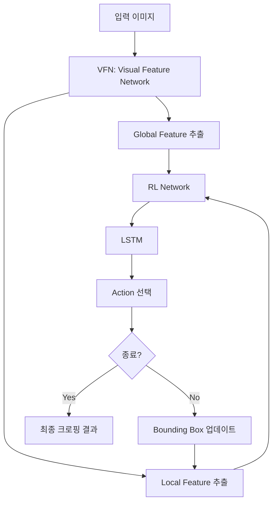
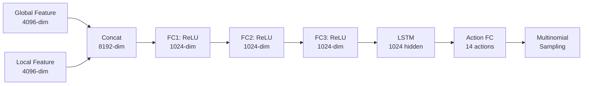
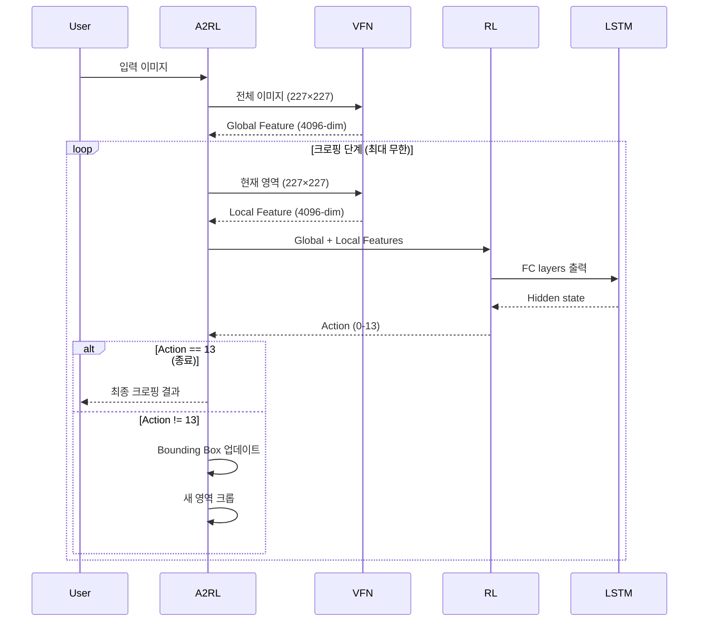

# A2RL 소스 코드 분석

## 프로젝트 개요

**A2-RL (Aesthetics Aware Reinforcement Learning)**은 강화학습 기반의 자동 이미지 크로핑 알고리즘입니다.

- **논문**: A2-RL: Aesthetics Aware Reinforcement Learning for Automatic Image Cropping
- **저자**: Debang Li, Huikai Wu, Junge Zhang, Kaiqi Huang
- **목적**: 원본 이미지에서 최적의 크로핑 영역을 단계별로 찾아내는 것

## 아키텍처 구조



## 핵심 파일 분석

### 1. [A2RL.py](file:///e:/AI/TF-A2RL-master/A2RL.py) - 메인 실행 파일

#### 주요 구성 요소

**전역 변수 및 초기화**
- `global_dtype`: TensorFlow 데이터 타입 (float32)
- `var_dict`: 사전 학습된 모델 가중치 (`vfn_rl.pkl`에서 로드)
- TensorFlow 플레이스홀더 생성

**플레이스홀더**
```python
image_placeholder = tf.placeholder(dtype=global_dtype, shape=[None,227,227,3])
h_placeholder = tf.placeholder(dtype=global_dtype, shape=[None,1024])
c_placeholder = tf.placeholder(dtype=global_dtype, shape=[None,1024])
```

#### `auto_cropping()` 함수 분석

이 함수는 A2RL의 핵심 로직을 구현합니다:

**초기화 단계** ([L27-31](file:///e:/AI/TF-A2RL-master/A2RL.py#L27-L31))
- 배치 크기 설정
- 종료 플래그 초기화 (모든 이미지가 크로핑 완료될 때까지)
- 초기 비율 설정: `[0, 0, 20, 20]` (전체 이미지)

**Global Feature 추출** ([L33-34](file:///e:/AI/TF-A2RL-master/A2RL.py#L33-L34))
- VFN을 통해 전체 이미지의 특징 추출
- 이 특징은 이후 모든 단계에서 재사용됨

**반복적 크로핑 루프** ([L38-48](file:///e:/AI/TF-A2RL-master/A2RL.py#L38-L48))
```python
while True:
    # 1. 현재 이미지 영역에서 action 선택
    action_np, h_np, c_np = sess.run(...)
    
    # 2. Action을 bounding box 변경으로 변환
    ratios, terminals = command2action(action_np, ratios, terminals)
    
    # 3. 새로운 bounding box 생성
    bbox = generate_bbox(origin_image, ratios)
    
    # 4. 모든 이미지가 완료되었는지 확인
    if np.sum(terminals) == batch_size:
        return bbox
    
    # 5. 새로운 영역으로 이미지 크롭
    img = crop_input(origin_image, bbox)
```

**메인 실행 로직** ([L50-60](file:///e:/AI/TF-A2RL-master/A2RL.py#L50-L60))
- 커맨드 라인 인자 파싱 (이미지 경로, 저장 경로)
- 이미지 로드 및 정규화 (0-1 범위로 스케일링)
- 평균 중심화 (0.5 빼기)
- 크로핑 실행 및 결과 저장

---

### 2. [network.py](file:///e:/AI/TF-A2RL-master/network.py) - 신경망 아키텍처

#### `conv()` 함수 ([L3-15](file:///e:/AI/TF-A2RL-master/network.py#L3-L15))

그룹 컨볼루션을 지원하는 커스텀 컨볼루션 레이어:
- **그룹 = 1**: 표준 컨볼루션
- **그룹 > 1**: 입력과 커널을 그룹으로 나누어 병렬 처리 (AlexNet 스타일)

#### `vfn_rl()` 함수 - 핵심 네트워크

이 함수는 두 가지 모드로 동작합니다:

**모드 1: VFN (Visual Feature Network)** - Global Feature 추출

AlexNet 기반 CNN 아키텍처:

| Layer | Type | Parameters | Output |
|-------|------|------------|--------|
| Conv1 | Conv + ReLU + LRN + MaxPool | 11×11, stride=4, 96 filters | Feature maps |
| Conv2 | Conv + ReLU + LRN + MaxPool | 5×5, 256 filters, group=2 | Feature maps |
| Conv3 | Conv + ReLU | 3×3, 384 filters | Feature maps |
| Conv4 | Conv + ReLU | 3×3, 384 filters, group=2 | Feature maps |
| Conv5 | Conv + ReLU + MaxPool | 3×3, 256 filters, group=2 | Feature maps |
| FC6 | Fully Connected + ReLU | - | 4096-dim vector |

**모드 2: RL Network** - Action 선택

Global feature와 local feature를 결합하여 action 선택:



**LSTM 구현** ([L124-130](file:///e:/AI/TF-A2RL-master/network.py#L124-L130))
```python
# LSTM 게이트 계산
W = tf.matmul(fc3, weight_ih) + bias_ih + tf.matmul(h, weight_hh) + bias_hh
i, f, g, o = tf.split(W, 4, axis=1)  # input, forget, gate, output

# 활성화 함수 적용
i = sigmoid(i)  # input gate
f = sigmoid(f)  # forget gate
g = tanh(g)     # cell gate
o = sigmoid(o)  # output gate

# 셀 상태 및 은닉 상태 업데이트
c = f*c + i*g   # 새로운 cell state
h = o*tanh(c)   # 새로운 hidden state
```

**Action 선택** ([L132-135](file:///e:/AI/TF-A2RL-master/network.py#L132-L135))
- LSTM 출력을 14개의 action 로짓으로 변환
- Multinomial sampling으로 확률적 action 선택

---

### 3. [actions.py](file:///e:/AI/TF-A2RL-master/actions.py) - Action 처리

#### Action 정의 (14개)

`command2action()` 함수는 14개의 action을 정의합니다:

| Action ID | 설명 | Ratio 변화 [left, top, right, bottom] |
|-----------|------|----------------------------------------|
| 0 | 모든 방향으로 축소 | [+1, +1, -1, -1] |
| 1 | 오른쪽/아래 축소 | [0, 0, -1, -1] |
| 2 | 왼쪽/아래 축소 | [+1, 0, 0, -1] |
| 3 | 위/오른쪽 축소 | [0, +1, -1, 0] |
| 4 | 왼쪽/위 이동 | [+1, +1, 0, 0] |
| 5 | 왼쪽/오른쪽 확장 | [+1, 0, +1, 0] |
| 6 | 왼쪽/오른쪽 축소 | [-1, 0, -1, 0] |
| 7 | 위/아래 축소 | [0, -1, 0, -1] |
| 8 | 위/아래 확장 | [0, +1, 0, +1] |
| 9 | 위 확장/아래 축소 | [0, +1, 0, -1] |
| 10 | 왼쪽 확장/오른쪽 축소 | [+1, 0, -1, 0] |
| 11 | 위 축소/아래 확장 | [0, -1, 0, +1] |
| 12 | 왼쪽 축소/오른쪽 확장 | [-1, 0, +1, 0] |
| 13 | **종료** | 변화 없음 |

#### 제약 조건 ([L56-59](file:///e:/AI/TF-A2RL-master/actions.py#L56-L59))

```python
# 비율을 0-20 범위로 제한
ratios = np.maximum(ratios, 0)
ratios = np.minimum(ratios, 20)

# 최소 크기 제약 (4/20 = 20% 이상)
if ratios[i, 2] - ratios[i, 0] <= 4 or ratios[i, 3] - ratios[i, 1] <= 4:
    terminals[i] = 1  # 너무 작으면 종료
```

#### `generate_bbox()` 함수 ([L63-76](file:///e:/AI/TF-A2RL-master/actions.py#L63-L76))

비율(0-20)을 실제 픽셀 좌표로 변환:
```python
xmin = int(float(ratio[0]) / 20 * width)
ymin = int(float(ratio[1]) / 20 * height)
xmax = int(float(ratio[2]) / 20 * width)
ymax = int(float(ratio[3]) / 20 * height)
```

#### `crop_input()` 함수 ([L78-84](file:///e:/AI/TF-A2RL-master/actions.py#L78-L84))

Bounding box로 이미지를 크롭하고 227×227로 리사이즈:
- `mode='constant'`: 경계 외부는 0으로 패딩
- 네트워크 입력 크기에 맞춤

---

## 알고리즘 동작 흐름



## 주요 특징 및 설계 결정

### 1. **Two-Stage Feature Extraction**
- **Global Feature**: 전체 이미지의 맥락 정보 (한 번만 계산)
- **Local Feature**: 현재 크로핑 영역의 세부 정보 (매 단계 계산)
- 이를 통해 전체적인 구도와 세부적인 미학을 모두 고려

### 2. **LSTM을 통한 순차적 의사결정**
- 이전 단계의 정보를 기억 (hidden state, cell state)
- 일관된 크로핑 전략 유지
- 단계별 최적화가 아닌 전체 시퀀스 최적화

### 3. **Reinforcement Learning 기반**
- Multinomial sampling으로 탐색(exploration) 가능
- 학습 시 보상 함수로 미학적 품질 평가
- 다양한 크로핑 전략 학습 가능

### 4. **효율적인 Action Space**
- 14개의 이산 action으로 단순화
- 대칭적인 action 설계 (확장/축소, 이동)
- 명시적인 종료 action

### 5. **안전 장치**
- 최소 크기 제약 (20% 이상)
- 비율 범위 제한 (0-20)
- 종료 조건 명확

## 기술적 제약 및 고려사항

### 장점
✅ 단계별 시각화 가능 (디버깅 용이)  
✅ 배치 처리 지원  
✅ 사전 학습된 VFN 활용 (전이 학습)  
✅ 확률적 탐색으로 다양한 결과 생성 가능  

### 제약사항
⚠️ TensorFlow 1.x 기반 (구버전)  
⚠️ 고정된 입력 크기 (227×227)  
⚠️ 종료 조건이 명확하지 않으면 무한 루프 가능  
⚠️ GPU 메모리 사용량이 클 수 있음  
⚠️ 실시간 처리에는 부적합 (반복적 추론 필요)  

### 개선 가능 영역
💡 TensorFlow 2.x로 마이그레이션  
💡 다양한 입력 크기 지원  
💡 최대 반복 횟수 제한 추가  
💡 배치 정규화 추가  
💡 Attention mechanism 도입  
💡 Multi-scale feature 활용  

## 사용 예시

```bash
# 단일 이미지 크로핑
python A2RL.py --image_path test_images/3846.jpg --save_path test_images/3846_cropped.jpg

# 배치 스크립트
sh example.sh
```

## 의존성

- **Python 3.x**
- **TensorFlow** (1.x 권장)
- **NumPy**
- **scikit-image** (이미지 I/O 및 변환)
- **pickle** (모델 로드)

## 성능 특성

- **입력**: 임의 크기 이미지
- **출력**: 크로핑된 이미지
- **처리 시간**: 이미지당 수 초 (GPU 기준)
- **메모리**: ~500MB (모델 가중치 포함)
- **평균 단계 수**: 5-10 단계

## 결론

A2RL은 강화학습을 활용한 혁신적인 이미지 크로핑 방법으로, 미학적 품질을 고려한 자동 크로핑을 수행합니다. VFN과 RL 네트워크의 결합, LSTM을 통한 순차적 의사결정, 그리고 잘 설계된 action space가 핵심 강점입니다. 다만 구버전 TensorFlow 사용과 고정된 입력 크기 등의 제약이 있어, 현대적인 프레임워크로의 업그레이드가 필요할 수 있습니다.
